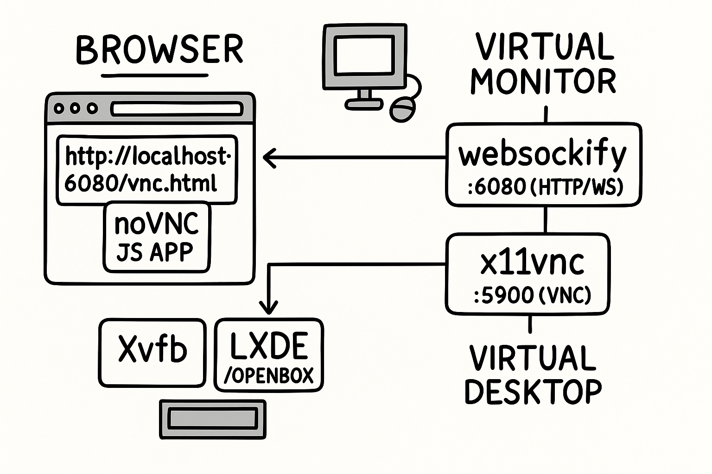
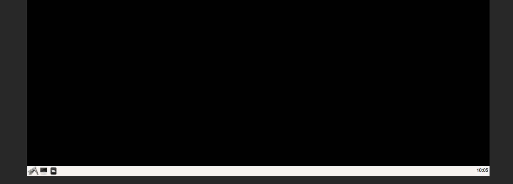

# lxde-novnc


[](https://hub.docker.com/r/jmeiracorbal/lxde-novnc)

This project provides a graphical interface for Linux desktop using the VNC protocol redirected to the browser throug websockets. It's ideal for remote GUI access, testing, or educational sandboxes.



# Getting started

To launch the LXDE desktop in your browser create a `docker-compose.yml` file like the following:

```yaml
version: '3.8'

services:
  desktop:
    image: jmeiracorbal/lxde-novnc:latest
    container_name: lxde-novnc
    ports:
      - "6080:6080"
      - "5900:5900"
    environment:
      - VNC_USER=docker
      - VNC_PASS=letmein
    restart: unless-stopped
```

Execute the compose:

```yaml
docker compose up -d
```

Required and optional ports:

* `6080`: creates the access via browser.
* `5900`: it's optional. Add if you need VNC access with a traditional client (Guacamole).

> After running, go to http://localhost:6080 and you'll see the LXDE desktop running on the browser.

## Components

* **Xvfb (virtual framebuffer)**

It's the output inside container, but is not real because simulates a memory screen where is drawed the desktop environment. Has the `DISPLAY=:0` value as a another Linux desktop app.

* **x11vnc server**

This project uses VNC protocol, like RDP (Remote Desktop), x11... In remote. `x11vnc` is the VNC server where the desktop is drawed; draw the background, panel, windows, menus, etc. over the framebuffer (:0) que provee Xvfb.

* **websockify** 

Connect VNC protocol through web sockets. The bridge is listen on port 6080 (HTTP/WebSocket) to translate WebSocket signal to TCP, and redirect the traffic inside port 5900, where is the real VNC server listen.
* noVNC: it's a VNC client. It's loaded from web browser (`/usr/share/novnc`).

# Setup and customization

You can customize the container using the environment variables in your compose file or using docker run command:

* `VNC_USER`: username created inside the container. Default value is docker.
* `VNC_PASS`: VNC password used if authentication is enabled. Default value is letmein.
* `RESOLUTION`: screen resolution of the virtual desktop (WxH). The default value is 1280x720.
* `DISPLAY`: it's the virtual display number (should not be changed). The default value is :0.

> By default, the container doesn't enforce the password auth. See the [Authentication and security](#authentication-and-security) section for how to enable it.

Example usage with custom resolution and credentials:

```yaml
environment:
  - VNC_USER=alice
  - VNC_PASS=s3cr3t
  - RESOLUTION=1440x900
```

# Authentication and security

This container doesn't use VNC password authentication as default (x11vnc is started with the flag -nopw). This is intentional to make the environment accessible. If password protection is required, remove the -nopw argument in entrypoint.sh and ensure VNC_PASS is correctly configured.

> If you want to add HTTP authentication bellow this container, it'll be performed externally. You can use tools like nginx, Traefik...

# LXPanel customization

The desktop panel has been preconfigured to provide a clean and minimal interface. You need to considerer that this components aren't included:
- No CPU usage monitor. Fails on runtime with Docker.
- No Desktop Pager (breaks the taskbar, check the issue).

The traditional LXDE layout is preserved. If you want to customize the panel, you can edit the panel definition file before building the image:



You can create on your project this structure:

```bash
mkdir -p config/lxpanel/LXDE/panels/panel
```

This panel file controls appearance and contents of the LXDE panel. You can add or remove elements: application launchers, taskbar, shutdown/logout buttons, etc.

Example:

```yaml
services:
  desktop:
    image: jmeiracorbal/lxde-novnc:latest
    ports:
      - "6080:6080"
      - "5900:5900"
    volumes:
      - ./config/lxpanel/LXDE/panels/panel:/home/docker/.config/lxpanel/LXDE/panels/panel:ro
    environment:
      - VNC_USER=docker
      - VNC_PASS=letmein
    restart: unless-stopped
```

The path `config/lxpanel/LXDE/panels/panel` represents the real structure on the system, but you can
include your own path on compose volume:

```yaml
    volumes:
      - ./panel:/home/docker/.config/lxpanel/LXDE/panels/panel:ro
```

When the container starts, the system will load your custom panel layout instead of the default.

## Minimal configuration for LXPanel

The panel configuration file is a complete layout definition. If you override it using a custom file, you need to known that the file contains all the minimal components to work correctly by default.

Example: if your file only defines the digital clock plugin, only the clock will appear on the panel. You won’t see the menu, taskbar or any other element unless the declared.

You can use the example. Copy and replace it by your custom lxpanel:

```bash
cp ./examples/panel ./lxpanel/panel
```

# Support

The most important idea is to create a minimal desktop experience that will run on any platform with Docker using Linux, macOS (Silicon, Intel) or Windows without require an external VNC client.

# Disclaimers 

Improvements are welcome, but this is a personal project designed to assist my own server manager. It's not intended for commercial use, nor is there any business interest associated with it.

Issues might exist and will be handled as time permits, but one should not expect any fixes or changes as certain. 

If you found a bug or have any suggestion, please create an [issue](https://github.com/jmeiracorbal/lxde-novnc/issues) in line with the [code of conduct](./CODE_OF_CONDUCT.md) and [Contributing guide](./CONTRIBUTING.md) of the project.

# License

The project is covered under the MIT License.

