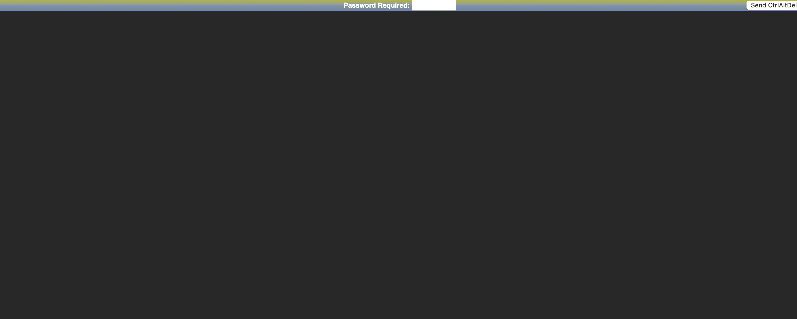

# LXDE noVNC


[](https://hub.docker.com/r/jmeiracorbal/lxde-novnc)

This project provides a graphical interface for Linux desktop with [noVNC](https://novnc.com/info.html) (on browser) through the signal of `x11vnc` server using webSockets. 

> It's ideal for remote access, testing or educational sandboxes. Security improvements are implemented but you can configure over you own responsability.

# Getting started

Quickly deploy, creating the `docker-compose.yml`:

```yaml
services:
  desktop:
    image: jmeiracorbal/lxde-novnc:latest
    container_name: lxde-novnc
    ports:
      - "6080:6080"
      - "5900:5900"
    environment:
      - SYSTEM_USER=docker
      - VNC_PASS=letmein
    restart: unless-stopped
```

Execute the compose file:

```yaml
docker compose up -d
```

Required ports:

* `6080`: creates the access via browser.

Optional ports:

* `5900`: Add if you need VNC access with a traditional client (e.g. `Apache Guacamole`).

> After running, go to open [localhost on port :6080](http://localhost:6080) and you'll see the LXDE desktop running on your browser.

# How it works

The internal signal from x11vnc is redirected using webSockets with websockify. noVNC show this signtal on browser.


## Xvfb (virtual framebuffer)

It's the output inside container, but is not real because simulates a memory screen where is drawed the desktop environment. Has the `DISPLAY=:0` value like a real Linux desktop app.

## x11vnc server

This project uses VNC protocol, like RDP (Remote Desktop), x11... In remote. `x11vnc` is the VNC server where the desktop is drawed. It's drawed in background; the panel, windows, menus... Over the framebuffer (:0) that provides `Xvfb`.

## webSockify

Connect VNC protocol through web sockets. The bridge is listen on port 6080 (HTTP/WebSocket) to translate WebSocket signal to TCP, and redirect the traffic inside port 5900, where is the real VNC server listen.

## noVNC

It's a VNC client library. Required to access on the browser. [Check this project](https://github.com/novnc/noVNC).

# Setup and customization

You can customize the container using the environment variables in your compose file or using docker run command:

* `SYSTEM_USER`: refers to the Linux user running the desktop session inside the container.
* `VNC_PASS`: VNC password used if authentication is enabled. Default value is letmein.
* `RESOLUTION`: screen resolution of the virtual desktop (WxH). The default value is 1280x720.
* `DISPLAY`: it's the virtual display number (should not be changed). The default value is :0.

Example usage with custom resolution and credentials:

```yaml
environment:
  - SYSTEM_USER=alice
  - VNC_PASS=s3cr3t
  - RESOLUTION=1440x900
```

> Server x11vnc exposes a graphical session running with the configured user (`docker` as default). This isn't the user required for VNC/noVNC.

## About security

You must to known: 
- The desktop is only running with the default user, for simplicity.
- This option is very light and quickly to run, ideal for sandbox or educational environments or tests...

> If you need a more stricted authentication, see the [Authentication and security](#authentication-and-security) section to known how to configure it.

# Authentication and security

The container use VNC password authentication as default (x11vnc is started with the flag `-nopw`). If you doesn't want the password protection as required, add the environment variable `ALLOW_NOPW` as false value.

## What is it covered with x11vnc with VNC_PASS

The parameter `VNC_PASS` on the compose only protects the connection to the VNC server. Anyway, this password blocks somebody that want to open a his client VNC and trying to access to the server.
* If you use `-nopw` anybody can access to the VNC serser without autentication.
*  If you remove it and add a password, this password was required to connect with a VNC client, but this actions it isn't a system authentication.



# Customize the panel

The desktop panel has been preconfigured to provide a clean and minimal interface, but it's my own configuration. For example, you need to known that this components aren't included:
- No CPU usage monitor. Fails on runtime with Docker on this moment.
- No Desktop Pager (breaks the taskbar).

The traditional LXDE layout is preserved. If you want to customize the panel, you can edit the panel definition file before building the image:


You can create on your project this structure:

```bash
mkdir -p config/lxpanel/LXDE/panels/panel
```

This panel file controls appearance and contents of the LXDE panel. You can add or remove elements: application launchers, taskbar, shutdown/logout buttons, etc.

Example:

```yaml
services:
  desktop:
    image: jmeiracorbal/lxde-novnc:latest
    ports:
      - "6080:6080"
      - "5900:5900"
    volumes:
      - ./config/lxpanel/LXDE/panels/panel:/home/docker/.config/lxpanel/LXDE/panels/panel:ro
    environment:
      - SYSTEM_USER=docker
      - VNC_PASS=letmein
    restart: unless-stopped
```

The path `config/lxpanel/LXDE/panels/panel` represents the real structure on the system, but you can
include your own path on compose volume:

```yaml
    volumes:
      - ./panel:/home/docker/.config/lxpanel/LXDE/panels/panel:ro
```

When the container starts, the system will load your custom panel layout instead of the default.

## Minimal configuration for LXPanel

>Important: you need to add the specific components recommended if you need a minimal desktop environment.

The panel configuration file is a complete layout definition. If you override it using a custom file, you need to known that the file contains all the minimal components to work correctly by default.

Example: if your file only defines the digital clock plugin, only the clock will appear on the panel. You won’t see the menu, taskbar or any other element unless the declared.

You can use the example. Copy and replace it by your custom lxpanel:

```bash
cp ./examples/panel ./lxpanel/panel
```

# Support related projects

* [Guaca-Guaca](https://github.com/jmeiracorbal/guaca-guaca): Guaca-Guaca is a pre-configured Apache Guacamole setup on Docker.
* [noVNC](https://github.com/CendioOssman/noVNC): the open-source VNC browser client - noVNC is a VNC client JavaScript library as well as an application built on top of that library. noVNC runs well in any modern browser, including mobile browsers (iOS and Android).
* [webSockify](https://github.com/CendioOssman/websockify): this project was formerly named wsproxy and was part of the noVNC project.

# Disclaimers 

> The most important idea is to create a minimal desktop experience that will run on any platform with Docker using Linux, macOS (Silicon, Intel) or Windows without any other compoments.

Improvements are welcome, but this is a personal project designed to assist my own daily work. Issues might exist and will be handled as the time permits.

If you found a bug, a feature or have any suggestion, please create an [issue](https://github.com/jmeiracorbal/lxde-novnc/issues) in line with the [code of conduct](./CODE_OF_CONDUCT.md) and [Contributing guide](./CONTRIBUTING.md) of the project.

# License

The project is covered under the MIT License.

